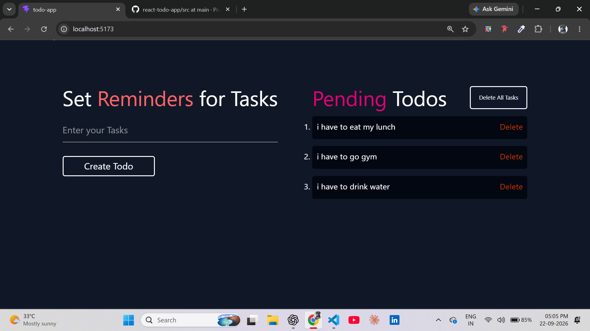
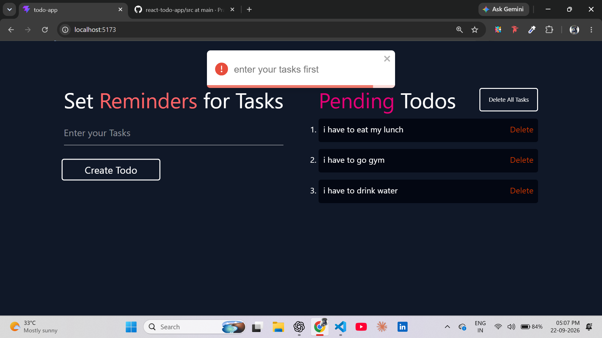
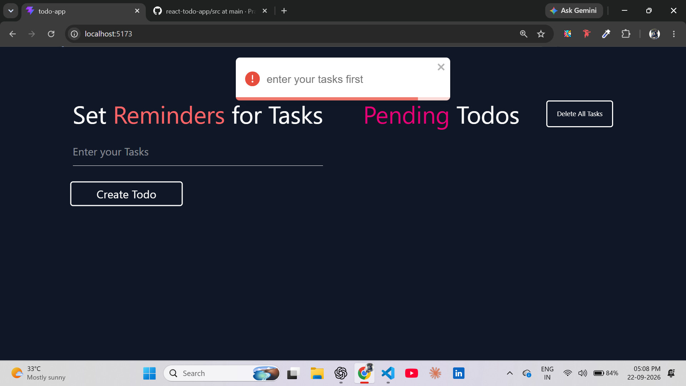

# 📝 React Todo App

A simple and responsive Todo application built with React.  
This project allows users to create, delete, and manage their daily tasks with form validation and toast notifications.

## 🚀 Features

- Create a new Todo
- Form validation
- Minimum 5 characters validation
- Delete individual Todos
- Delete all Todos
- Success and error toast notifications
- Unique Todo IDs using Nanoid
- Responsive user interface

## 🛠️ Technologies Used

- React
- Vite
- JavaScript
- Tailwind CSS
- React Hook Form
- React Toastify
- Nanoid

## 📸 Preview

### Todo App

### Required Field Validation

### Minimum Length Validation

## 📂 Project Structure

src/
├── components/
│   ├── Create.jsx
│   └── Read.jsx
├── App.jsx
├── main.jsx
└── index.css